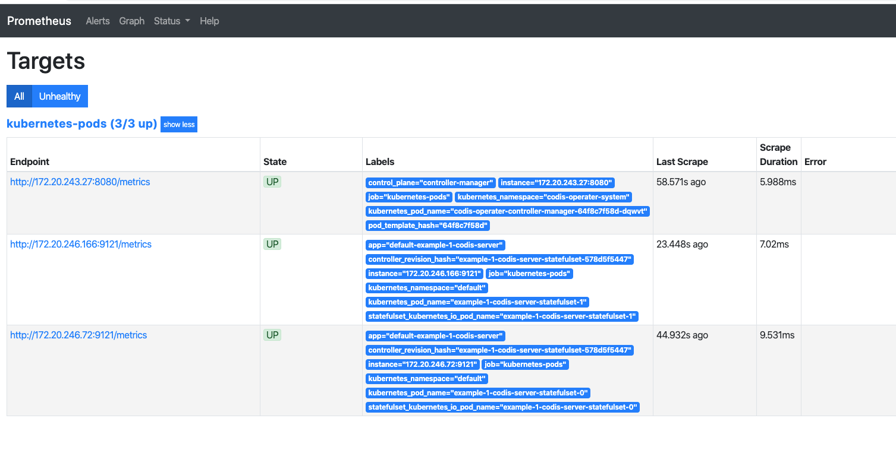
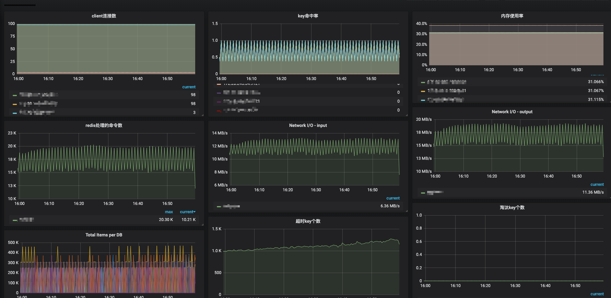
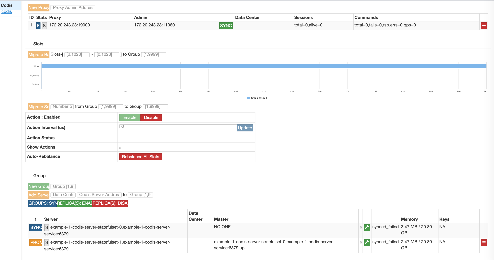

## Notes: 
1.This codis only supports Kubernetes version 1.16+.  
2.Before start, make sure you have a zookeeper cluster.  
3.Cluster monitoring is implemented based on prometheus + grafana.   
4.Support the deployment of multiple codis clusters in the same kubernetes cluster by product name.

## Features
### Log collection:   

The logs of codis-cluster are mounted on the host directory. It is recommended to deploy the filebeat program in daemonset mode. you can deploy filebeat on kubernetes as this: ***kubectl apply -f config/other/filebeat/***
```bash
[root@localhost ~]# tree /data/logs/
/data/logs/
├── codis-backup
├── codis-dashboard
│   ├── default_example-1-codis-dashboard-deployment-697578cd68-qcn7z.log
├── codis-fe
│   ├── default_example-1-codis-fe-deployment-85cd5d776b-4mw7n.log
├── codis-ha
│   ├── default_example-1-codis-ha-deployment-6c96689bdd-6dvvw.log
├── codis-proxy
│   ├── default_example-1-codis-proxy-deployment-6bcf7945cf-dnb7z.log
└── codis-server
    ├── example-1-codis-server-statefulset-0
    │   └── default_example-1-codis-server-statefulset-0.log
    └── example-1-codis-server-statefulset-1
        └── default_example-1-codis-server-statefulset-1.log
```

### Service load balancing:
Supports NodePort and LoadBalancer
NodePort method, it is recommended to hang Nginx for load balancing
LoadBalancer:  

 1.Support Alibaba Cloud's slb, but need to deploy cloud-controller-manager, and then specify the instanceid in the deployment file. you can deploy cloud-controller-manager on kubernetes as this: ***kubectl apply -f config/other/cloud-control-manager/***  
 
 2.Ingress and NodePort, Just specify the port number and load balancing type, codis-operater will automatically create the corresponding load balancing.  
 

### Monitoring collection:
*Provide three dimensional monitoring methods:*   

1.Cluster-level monitoring: metric-stat and metric-server. metric-stat collects running snapshots, and detailed monitoring data collected by metric-server. you can deploy it on kubernetes as this: ***kubectl apply -f config/other/metric-stat/*** and ***kubectl apply -f config/other/metric-server/*** 

2.The codis-operater running stats. exec command "***curl 127.0.0.1:8080/metrics***" in codis-operater-manager pod. outputs as:
```text
# HELP controller_runtime_reconcile_time_seconds Length of time per reconciliation per controller
# TYPE controller_runtime_reconcile_time_seconds histogram
controller_runtime_reconcile_time_seconds_bucket{controller="codiscluster",le="0.005"} 0
controller_runtime_reconcile_time_seconds_bucket{controller="codiscluster",le="0.01"} 0
controller_runtime_reconcile_time_seconds_bucket{controller="codiscluster",le="0.025"} 0
controller_runtime_reconcile_time_seconds_bucket{controller="codiscluster",le="0.05"} 0
controller_runtime_reconcile_time_seconds_bucket{controller="codiscluster",le="0.1"} 0
controller_runtime_reconcile_time_seconds_bucket{controller="codiscluster",le="0.25"} 0
controller_runtime_reconcile_time_seconds_bucket{controller="codiscluster",le="0.5"} 0
controller_runtime_reconcile_time_seconds_bucket{controller="codiscluster",le="1"} 1
controller_runtime_reconcile_time_seconds_bucket{controller="codiscluster",le="2.5"} 1
controller_runtime_reconcile_time_seconds_bucket{controller="codiscluster",le="5"} 1
controller_runtime_reconcile_time_seconds_bucket{controller="codiscluster",le="10"} 1
controller_runtime_reconcile_time_seconds_bucket{controller="codiscluster",le="+Inf"} 1
controller_runtime_reconcile_time_seconds_sum{controller="codiscluster"} 0.655809153
controller_runtime_reconcile_time_seconds_count{controller="codiscluster"} 1
# HELP controller_runtime_reconcile_total Total number of reconciliations per controller
# TYPE controller_runtime_reconcile_total counter
controller_runtime_reconcile_total{controller="codiscluster",result="success"} 1
# HELP go_gc_duration_seconds A summary of the GC invocation durations.
# TYPE go_gc_duration_seconds summary
go_gc_duration_seconds{quantile="0"} 2.8288e-05
go_gc_duration_seconds{quantile="0.25"} 4.9149e-05
go_gc_duration_seconds{quantile="0.5"} 7.2873e-05
go_gc_duration_seconds{quantile="0.75"} 7.8195e-05
go_gc_duration_seconds{quantile="1"} 0.000113229
go_gc_duration_seconds_sum 0.000694752
go_gc_duration_seconds_count 10
# HELP go_goroutines Number of goroutines that currently exist.
# TYPE go_goroutines gauge
go_goroutines 60
# HELP go_info Information about the Go environment.
# TYPE go_info gauge
go_info{version="go1.12.4"} 1
# HELP go_memstats_alloc_bytes Number of bytes allocated and still in use.
# TYPE go_memstats_alloc_bytes gauge
go_memstats_alloc_bytes 4.935832e+06
# HELP go_memstats_alloc_bytes_total Total number of bytes allocated, even if freed.
# TYPE go_memstats_alloc_bytes_total counter
go_memstats_alloc_bytes_total 2.2845968e+07
# HELP go_memstats_buck_hash_sys_bytes Number of bytes used by the profiling bucket hash table.
# TYPE go_memstats_buck_hash_sys_bytes gauge
go_memstats_buck_hash_sys_bytes 1.457416e+06
# HELP go_memstats_frees_total Total number of frees.
# TYPE go_memstats_frees_total counter
go_memstats_frees_total 286961
# HELP go_memstats_gc_cpu_fraction The fraction of this program's available CPU time used by the GC since the program started.
# TYPE go_memstats_gc_cpu_fraction gauge
go_memstats_gc_cpu_fraction 3.596606969570028e-05
# HELP go_memstats_gc_sys_bytes Number of bytes used for garbage collection system metadata.
# TYPE go_memstats_gc_sys_bytes gauge
go_memstats_gc_sys_bytes 2.38592e+06
# HELP go_memstats_heap_alloc_bytes Number of heap bytes allocated and still in use.
# TYPE go_memstats_heap_alloc_bytes gauge
go_memstats_heap_alloc_bytes 4.935832e+06
# HELP go_memstats_heap_idle_bytes Number of heap bytes waiting to be used.
# TYPE go_memstats_heap_idle_bytes gauge
go_memstats_heap_idle_bytes 5.7081856e+07
# HELP go_memstats_heap_inuse_bytes Number of heap bytes that are in use.
# TYPE go_memstats_heap_inuse_bytes gauge
go_memstats_heap_inuse_bytes 8.781824e+06
# HELP go_memstats_heap_objects Number of allocated objects.
# TYPE go_memstats_heap_objects gauge
go_memstats_heap_objects 42681
# HELP go_memstats_heap_released_bytes Number of heap bytes released to OS.
# TYPE go_memstats_heap_released_bytes gauge
go_memstats_heap_released_bytes 0
# HELP go_memstats_heap_sys_bytes Number of heap bytes obtained from system.
# TYPE go_memstats_heap_sys_bytes gauge
go_memstats_heap_sys_bytes 6.586368e+07
# HELP go_memstats_last_gc_time_seconds Number of seconds since 1970 of last garbage collection.
# TYPE go_memstats_last_gc_time_seconds gauge
go_memstats_last_gc_time_seconds 1.5789002681856582e+09
# HELP go_memstats_lookups_total Total number of pointer lookups.
# TYPE go_memstats_lookups_total counter
go_memstats_lookups_total 0
# HELP go_memstats_mallocs_total Total number of mallocs.
# TYPE go_memstats_mallocs_total counter
go_memstats_mallocs_total 329642
# HELP go_memstats_mcache_inuse_bytes Number of bytes in use by mcache structures.
# TYPE go_memstats_mcache_inuse_bytes gauge
go_memstats_mcache_inuse_bytes 13888
# HELP go_memstats_mcache_sys_bytes Number of bytes used for mcache structures obtained from system.
# TYPE go_memstats_mcache_sys_bytes gauge
go_memstats_mcache_sys_bytes 16384
# HELP go_memstats_mspan_inuse_bytes Number of bytes in use by mspan structures.
# TYPE go_memstats_mspan_inuse_bytes gauge
go_memstats_mspan_inuse_bytes 129024
# HELP go_memstats_mspan_sys_bytes Number of bytes used for mspan structures obtained from system.
# TYPE go_memstats_mspan_sys_bytes gauge
go_memstats_mspan_sys_bytes 147456
# HELP go_memstats_next_gc_bytes Number of heap bytes when next garbage collection will take place.
# TYPE go_memstats_next_gc_bytes gauge
go_memstats_next_gc_bytes 9.73704e+06
# HELP go_memstats_other_sys_bytes Number of bytes used for other system allocations.
# TYPE go_memstats_other_sys_bytes gauge
go_memstats_other_sys_bytes 2.218992e+06
# HELP go_memstats_stack_inuse_bytes Number of bytes in use by the stack allocator.
# TYPE go_memstats_stack_inuse_bytes gauge
go_memstats_stack_inuse_bytes 1.245184e+06
# HELP go_memstats_stack_sys_bytes Number of bytes obtained from system for stack allocator.
# TYPE go_memstats_stack_sys_bytes gauge
go_memstats_stack_sys_bytes 1.245184e+06
# HELP go_memstats_sys_bytes Number of bytes obtained from system.
# TYPE go_memstats_sys_bytes gauge
go_memstats_sys_bytes 7.3335032e+07
# HELP go_threads Number of OS threads created.
# TYPE go_threads gauge
go_threads 22
# HELP rest_client_request_latency_seconds Request latency in seconds. Broken down by verb and URL.
# TYPE rest_client_request_latency_seconds histogram
rest_client_request_latency_seconds_bucket{url="https://kubernetes.docker.internal:6443/%7Bprefix%7D",verb="GET",le="0.001"} 0
rest_client_request_latency_seconds_bucket{url="https://kubernetes.docker.internal:6443/%7Bprefix%7D",verb="GET",le="0.002"} 0
rest_client_request_latency_seconds_bucket{url="https://kubernetes.docker.internal:6443/%7Bprefix%7D",verb="GET",le="0.004"} 10
rest_client_request_latency_seconds_bucket{url="https://kubernetes.docker.internal:6443/%7Bprefix%7D",verb="GET",le="0.008"} 13
rest_client_request_latency_seconds_bucket{url="https://kubernetes.docker.internal:6443/%7Bprefix%7D",verb="GET",le="0.016"} 39
rest_client_request_latency_seconds_bucket{url="https://kubernetes.docker.internal:6443/%7Bprefix%7D",verb="GET",le="0.032"} 45
rest_client_request_latency_seconds_bucket{url="https://kubernetes.docker.internal:6443/%7Bprefix%7D",verb="GET",le="0.064"} 45
rest_client_request_latency_seconds_bucket{url="https://kubernetes.docker.internal:6443/%7Bprefix%7D",verb="GET",le="0.128"} 45
rest_client_request_latency_seconds_bucket{url="https://kubernetes.docker.internal:6443/%7Bprefix%7D",verb="GET",le="0.256"} 45
rest_client_request_latency_seconds_bucket{url="https://kubernetes.docker.internal:6443/%7Bprefix%7D",verb="GET",le="0.512"} 45
rest_client_request_latency_seconds_bucket{url="https://kubernetes.docker.internal:6443/%7Bprefix%7D",verb="GET",le="+Inf"} 45
rest_client_request_latency_seconds_sum{url="https://kubernetes.docker.internal:6443/%7Bprefix%7D",verb="GET"} 0.5298866099999998
rest_client_request_latency_seconds_count{url="https://kubernetes.docker.internal:6443/%7Bprefix%7D",verb="GET"} 45
rest_client_request_latency_seconds_bucket{url="https://kubernetes.docker.internal:6443/%7Bprefix%7D",verb="PUT",le="0.001"} 0
rest_client_request_latency_seconds_bucket{url="https://kubernetes.docker.internal:6443/%7Bprefix%7D",verb="PUT",le="0.002"} 0
rest_client_request_latency_seconds_bucket{url="https://kubernetes.docker.internal:6443/%7Bprefix%7D",verb="PUT",le="0.004"} 0
rest_client_request_latency_seconds_bucket{url="https://kubernetes.docker.internal:6443/%7Bprefix%7D",verb="PUT",le="0.008"} 0
rest_client_request_latency_seconds_bucket{url="https://kubernetes.docker.internal:6443/%7Bprefix%7D",verb="PUT",le="0.016"} 1
rest_client_request_latency_seconds_bucket{url="https://kubernetes.docker.internal:6443/%7Bprefix%7D",verb="PUT",le="0.032"} 3
rest_client_request_latency_seconds_bucket{url="https://kubernetes.docker.internal:6443/%7Bprefix%7D",verb="PUT",le="0.064"} 4
rest_client_request_latency_seconds_bucket{url="https://kubernetes.docker.internal:6443/%7Bprefix%7D",verb="PUT",le="0.128"} 4
rest_client_request_latency_seconds_bucket{url="https://kubernetes.docker.internal:6443/%7Bprefix%7D",verb="PUT",le="0.256"} 4
rest_client_request_latency_seconds_bucket{url="https://kubernetes.docker.internal:6443/%7Bprefix%7D",verb="PUT",le="0.512"} 4
rest_client_request_latency_seconds_bucket{url="https://kubernetes.docker.internal:6443/%7Bprefix%7D",verb="PUT",le="+Inf"} 4
rest_client_request_latency_seconds_sum{url="https://kubernetes.docker.internal:6443/%7Bprefix%7D",verb="PUT"} 0.09006881
rest_client_request_latency_seconds_count{url="https://kubernetes.docker.internal:6443/%7Bprefix%7D",verb="PUT"} 4
rest_client_request_latency_seconds_bucket{url="https://kubernetes.docker.internal:6443/api?timeout=32s",verb="GET",le="0.001"} 0
rest_client_request_latency_seconds_bucket{url="https://kubernetes.docker.internal:6443/api?timeout=32s",verb="GET",le="0.002"} 0
rest_client_request_latency_seconds_bucket{url="https://kubernetes.docker.internal:6443/api?timeout=32s",verb="GET",le="0.004"} 0
rest_client_request_latency_seconds_bucket{url="https://kubernetes.docker.internal:6443/api?timeout=32s",verb="GET",le="0.008"} 0
rest_client_request_latency_seconds_bucket{url="https://kubernetes.docker.internal:6443/api?timeout=32s",verb="GET",le="0.016"} 0
rest_client_request_latency_seconds_bucket{url="https://kubernetes.docker.internal:6443/api?timeout=32s",verb="GET",le="0.032"} 1
rest_client_request_latency_seconds_bucket{url="https://kubernetes.docker.internal:6443/api?timeout=32s",verb="GET",le="0.064"} 1
rest_client_request_latency_seconds_bucket{url="https://kubernetes.docker.internal:6443/api?timeout=32s",verb="GET",le="0.128"} 1
rest_client_request_latency_seconds_bucket{url="https://kubernetes.docker.internal:6443/api?timeout=32s",verb="GET",le="0.256"} 1
rest_client_request_latency_seconds_bucket{url="https://kubernetes.docker.internal:6443/api?timeout=32s",verb="GET",le="0.512"} 1
rest_client_request_latency_seconds_bucket{url="https://kubernetes.docker.internal:6443/api?timeout=32s",verb="GET",le="+Inf"} 1
rest_client_request_latency_seconds_sum{url="https://kubernetes.docker.internal:6443/api?timeout=32s",verb="GET"} 0.031397464
rest_client_request_latency_seconds_count{url="https://kubernetes.docker.internal:6443/api?timeout=32s",verb="GET"} 1
rest_client_request_latency_seconds_bucket{url="https://kubernetes.docker.internal:6443/apis?timeout=32s",verb="GET",le="0.001"} 0
rest_client_request_latency_seconds_bucket{url="https://kubernetes.docker.internal:6443/apis?timeout=32s",verb="GET",le="0.002"} 0
rest_client_request_latency_seconds_bucket{url="https://kubernetes.docker.internal:6443/apis?timeout=32s",verb="GET",le="0.004"} 1
rest_client_request_latency_seconds_bucket{url="https://kubernetes.docker.internal:6443/apis?timeout=32s",verb="GET",le="0.008"} 1
rest_client_request_latency_seconds_bucket{url="https://kubernetes.docker.internal:6443/apis?timeout=32s",verb="GET",le="0.016"} 1
rest_client_request_latency_seconds_bucket{url="https://kubernetes.docker.internal:6443/apis?timeout=32s",verb="GET",le="0.032"} 1
rest_client_request_latency_seconds_bucket{url="https://kubernetes.docker.internal:6443/apis?timeout=32s",verb="GET",le="0.064"} 1
rest_client_request_latency_seconds_bucket{url="https://kubernetes.docker.internal:6443/apis?timeout=32s",verb="GET",le="0.128"} 1
rest_client_request_latency_seconds_bucket{url="https://kubernetes.docker.internal:6443/apis?timeout=32s",verb="GET",le="0.256"} 1
rest_client_request_latency_seconds_bucket{url="https://kubernetes.docker.internal:6443/apis?timeout=32s",verb="GET",le="0.512"} 1
rest_client_request_latency_seconds_bucket{url="https://kubernetes.docker.internal:6443/apis?timeout=32s",verb="GET",le="+Inf"} 1
rest_client_request_latency_seconds_sum{url="https://kubernetes.docker.internal:6443/apis?timeout=32s",verb="GET"} 0.002722764
rest_client_request_latency_seconds_count{url="https://kubernetes.docker.internal:6443/apis?timeout=32s",verb="GET"} 1
# HELP rest_client_requests_total Number of HTTP requests, partitioned by status code, method, and host.
# TYPE rest_client_requests_total counter
rest_client_requests_total{code="200",host="kubernetes.docker.internal:6443",method="GET"} 53
rest_client_requests_total{code="200",host="kubernetes.docker.internal:6443",method="PUT"} 4
# HELP workqueue_adds_total Total number of adds handled by workqueue
# TYPE workqueue_adds_total counter
workqueue_adds_total{name="codiscluster"} 1
# HELP workqueue_depth Current depth of workqueue
# TYPE workqueue_depth gauge
workqueue_depth{name="codiscluster"} 0
# HELP workqueue_longest_running_processor_seconds How many seconds has the longest running processor for workqueue been running.
# TYPE workqueue_longest_running_processor_seconds gauge
workqueue_longest_running_processor_seconds{name="codiscluster"} 0
# HELP workqueue_queue_duration_seconds How long in seconds an item stays in workqueue before being requested.
# TYPE workqueue_queue_duration_seconds histogram
workqueue_queue_duration_seconds_bucket{name="codiscluster",le="1e-08"} 0
workqueue_queue_duration_seconds_bucket{name="codiscluster",le="1e-07"} 0
workqueue_queue_duration_seconds_bucket{name="codiscluster",le="1e-06"} 0
workqueue_queue_duration_seconds_bucket{name="codiscluster",le="9.999999999999999e-06"} 0
workqueue_queue_duration_seconds_bucket{name="codiscluster",le="9.999999999999999e-05"} 0
workqueue_queue_duration_seconds_bucket{name="codiscluster",le="0.001"} 0
workqueue_queue_duration_seconds_bucket{name="codiscluster",le="0.01"} 0
workqueue_queue_duration_seconds_bucket{name="codiscluster",le="0.1"} 0
workqueue_queue_duration_seconds_bucket{name="codiscluster",le="1"} 1
workqueue_queue_duration_seconds_bucket{name="codiscluster",le="10"} 1
workqueue_queue_duration_seconds_bucket{name="codiscluster",le="+Inf"} 1
workqueue_queue_duration_seconds_sum{name="codiscluster"} 0.104426191
workqueue_queue_duration_seconds_count{name="codiscluster"} 1
# HELP workqueue_retries_total Total number of retries handled by workqueue
# TYPE workqueue_retries_total counter
workqueue_retries_total{name="codiscluster"} 0
# HELP workqueue_unfinished_work_seconds How many seconds of work has done that is in progress and hasn't been observed by work_duration. Large values indicate stuck threads. One can deduce the number of stuck threads by observing the rate at which this increases.
# TYPE workqueue_unfinished_work_seconds gauge
workqueue_unfinished_work_seconds{name="codiscluster"} 0
# HELP workqueue_work_duration_seconds How long in seconds processing an item from workqueue takes.
# TYPE workqueue_work_duration_seconds histogram
workqueue_work_duration_seconds_bucket{name="codiscluster",le="1e-08"} 0
workqueue_work_duration_seconds_bucket{name="codiscluster",le="1e-07"} 0
workqueue_work_duration_seconds_bucket{name="codiscluster",le="1e-06"} 0
workqueue_work_duration_seconds_bucket{name="codiscluster",le="9.999999999999999e-06"} 0
workqueue_work_duration_seconds_bucket{name="codiscluster",le="9.999999999999999e-05"} 0
workqueue_work_duration_seconds_bucket{name="codiscluster",le="0.001"} 0
workqueue_work_duration_seconds_bucket{name="codiscluster",le="0.01"} 0
workqueue_work_duration_seconds_bucket{name="codiscluster",le="0.1"} 0
workqueue_work_duration_seconds_bucket{name="codiscluster",le="1"} 1
workqueue_work_duration_seconds_bucket{name="codiscluster",le="10"} 1
workqueue_work_duration_seconds_bucket{name="codiscluster",le="+Inf"} 1
workqueue_work_duration_seconds_sum{name="codiscluster"} 0.655860817
workqueue_work_duration_seconds_count{name="codiscluster"} 1
```

3.The codis-server monitor use docer image ***oliver006/redis_exporter:latest***, And 
have running as a sidecar with codis-server in same pod.   
```text
# HELP go_gc_duration_seconds A summary of the GC invocation durations.
# TYPE go_gc_duration_seconds summary
go_gc_duration_seconds{quantile="0"} 2.2678e-05
go_gc_duration_seconds{quantile="0.25"} 2.6211e-05
go_gc_duration_seconds{quantile="0.5"} 2.9844e-05
go_gc_duration_seconds{quantile="0.75"} 6.5233e-05
go_gc_duration_seconds{quantile="1"} 0.000251952
go_gc_duration_seconds_sum 0.001886378
go_gc_duration_seconds_count 33
# HELP go_goroutines Number of goroutines that currently exist.
# TYPE go_goroutines gauge
go_goroutines 7
# HELP go_info Information about the Go environment.
# TYPE go_info gauge
go_info{version="go1.13.5"} 1
# HELP go_memstats_alloc_bytes Number of bytes allocated and still in use.
# TYPE go_memstats_alloc_bytes gauge
go_memstats_alloc_bytes 3.694672e+06
# HELP go_memstats_alloc_bytes_total Total number of bytes allocated, even if freed.
# TYPE go_memstats_alloc_bytes_total counter
go_memstats_alloc_bytes_total 6.0326448e+07
# HELP go_memstats_buck_hash_sys_bytes Number of bytes used by the profiling bucket hash table.
# TYPE go_memstats_buck_hash_sys_bytes gauge
go_memstats_buck_hash_sys_bytes 1.450171e+06
# HELP go_memstats_frees_total Total number of frees.
# TYPE go_memstats_frees_total counter
go_memstats_frees_total 246939
# HELP go_memstats_gc_cpu_fraction The fraction of this program's available CPU time used by the GC since the program started.
# TYPE go_memstats_gc_cpu_fraction gauge
go_memstats_gc_cpu_fraction 7.008972357965348e-07
# HELP go_memstats_gc_sys_bytes Number of bytes used for garbage collection system metadata.
# TYPE go_memstats_gc_sys_bytes gauge
go_memstats_gc_sys_bytes 2.443264e+06
# HELP go_memstats_heap_alloc_bytes Number of heap bytes allocated and still in use.
# TYPE go_memstats_heap_alloc_bytes gauge
go_memstats_heap_alloc_bytes 3.694672e+06
# HELP go_memstats_heap_idle_bytes Number of heap bytes waiting to be used.
# TYPE go_memstats_heap_idle_bytes gauge
go_memstats_heap_idle_bytes 6.1431808e+07
# HELP go_memstats_heap_inuse_bytes Number of heap bytes that are in use.
# TYPE go_memstats_heap_inuse_bytes gauge
go_memstats_heap_inuse_bytes 4.825088e+06
# HELP go_memstats_heap_objects Number of allocated objects.
# TYPE go_memstats_heap_objects gauge
go_memstats_heap_objects 4832
# HELP go_memstats_heap_released_bytes Number of heap bytes released to OS.
# TYPE go_memstats_heap_released_bytes gauge
go_memstats_heap_released_bytes 6.0817408e+07
# HELP go_memstats_heap_sys_bytes Number of heap bytes obtained from system.
# TYPE go_memstats_heap_sys_bytes gauge
go_memstats_heap_sys_bytes 6.6256896e+07
# HELP go_memstats_last_gc_time_seconds Number of seconds since 1970 of last garbage collection.
# TYPE go_memstats_last_gc_time_seconds gauge
go_memstats_last_gc_time_seconds 1.578905409624648e+09
# HELP go_memstats_lookups_total Total number of pointer lookups.
# TYPE go_memstats_lookups_total counter
go_memstats_lookups_total 0
# HELP go_memstats_mallocs_total Total number of mallocs.
# TYPE go_memstats_mallocs_total counter
go_memstats_mallocs_total 251771
# HELP go_memstats_mcache_inuse_bytes Number of bytes in use by mcache structures.
# TYPE go_memstats_mcache_inuse_bytes gauge
go_memstats_mcache_inuse_bytes 55552
# HELP go_memstats_mcache_sys_bytes Number of bytes used for mcache structures obtained from system.
# TYPE go_memstats_mcache_sys_bytes gauge
go_memstats_mcache_sys_bytes 65536
# HELP go_memstats_mspan_inuse_bytes Number of bytes in use by mspan structures.
# TYPE go_memstats_mspan_inuse_bytes gauge
go_memstats_mspan_inuse_bytes 37672
# HELP go_memstats_mspan_sys_bytes Number of bytes used for mspan structures obtained from system.
# TYPE go_memstats_mspan_sys_bytes gauge
go_memstats_mspan_sys_bytes 49152
# HELP go_memstats_next_gc_bytes Number of heap bytes when next garbage collection will take place.
# TYPE go_memstats_next_gc_bytes gauge
go_memstats_next_gc_bytes 4.900752e+06
# HELP go_memstats_other_sys_bytes Number of bytes used for other system allocations.
# TYPE go_memstats_other_sys_bytes gauge
go_memstats_other_sys_bytes 2.021437e+06
# HELP go_memstats_stack_inuse_bytes Number of bytes in use by the stack allocator.
# TYPE go_memstats_stack_inuse_bytes gauge
go_memstats_stack_inuse_bytes 851968
# HELP go_memstats_stack_sys_bytes Number of bytes obtained from system for stack allocator.
# TYPE go_memstats_stack_sys_bytes gauge
go_memstats_stack_sys_bytes 851968
# HELP go_memstats_sys_bytes Number of bytes obtained from system.
# TYPE go_memstats_sys_bytes gauge
go_memstats_sys_bytes 7.3138424e+07
# HELP go_threads Number of OS threads created.
# TYPE go_threads gauge
go_threads 14
# HELP process_cpu_seconds_total Total user and system CPU time spent in seconds.
# TYPE process_cpu_seconds_total counter
process_cpu_seconds_total 0.62
# HELP process_max_fds Maximum number of open file descriptors.
# TYPE process_max_fds gauge
process_max_fds 1.048576e+06
# HELP process_open_fds Number of open file descriptors.
# TYPE process_open_fds gauge
process_open_fds 9
# HELP process_resident_memory_bytes Resident memory size in bytes.
# TYPE process_resident_memory_bytes gauge
process_resident_memory_bytes 9.105408e+06
# HELP process_start_time_seconds Start time of the process since unix epoch in seconds.
# TYPE process_start_time_seconds gauge
process_start_time_seconds 1.57890138288e+09
# HELP process_virtual_memory_bytes Virtual memory size in bytes.
# TYPE process_virtual_memory_bytes gauge
process_virtual_memory_bytes 1.15740672e+08
# HELP process_virtual_memory_max_bytes Maximum amount of virtual memory available in bytes.
# TYPE process_virtual_memory_max_bytes gauge
process_virtual_memory_max_bytes -1
# HELP redis_aof_current_rewrite_duration_sec aof_current_rewrite_duration_sec metric
# TYPE redis_aof_current_rewrite_duration_sec gauge
redis_aof_current_rewrite_duration_sec -1
# HELP redis_aof_enabled aof_enabled metric
# TYPE redis_aof_enabled gauge
redis_aof_enabled 0
# HELP redis_aof_last_bgrewrite_status aof_last_bgrewrite_status metric
# TYPE redis_aof_last_bgrewrite_status gauge
redis_aof_last_bgrewrite_status 1
# HELP redis_aof_last_rewrite_duration_sec aof_last_rewrite_duration_sec metric
# TYPE redis_aof_last_rewrite_duration_sec gauge
redis_aof_last_rewrite_duration_sec -1
# HELP redis_aof_last_write_status aof_last_write_status metric
# TYPE redis_aof_last_write_status gauge
redis_aof_last_write_status 1
# HELP redis_aof_rewrite_in_progress aof_rewrite_in_progress metric
# TYPE redis_aof_rewrite_in_progress gauge
redis_aof_rewrite_in_progress 0
# HELP redis_aof_rewrite_scheduled aof_rewrite_scheduled metric
# TYPE redis_aof_rewrite_scheduled gauge
redis_aof_rewrite_scheduled 0
# HELP redis_blocked_clients blocked_clients metric
# TYPE redis_blocked_clients gauge
redis_blocked_clients 0
# HELP redis_client_biggest_input_buf client_biggest_input_buf metric
# TYPE redis_client_biggest_input_buf gauge
redis_client_biggest_input_buf 0
# HELP redis_client_longest_output_list client_longest_output_list metric
# TYPE redis_client_longest_output_list gauge
redis_client_longest_output_list 0
# HELP redis_cluster_enabled cluster_enabled metric
# TYPE redis_cluster_enabled gauge
redis_cluster_enabled 0
# HELP redis_commands_duration_seconds_total Total amount of time in seconds spent per command
# TYPE redis_commands_duration_seconds_total counter
redis_commands_duration_seconds_total{cmd="client"} 0.000153
redis_commands_duration_seconds_total{cmd="config"} 0.06306
redis_commands_duration_seconds_total{cmd="info"} 0.237318
redis_commands_duration_seconds_total{cmd="latency"} 0.000134
redis_commands_duration_seconds_total{cmd="ping"} 1e-06
redis_commands_duration_seconds_total{cmd="slowlog"} 0.000278
# HELP redis_commands_processed_total commands_processed_total metric
# TYPE redis_commands_processed_total counter
redis_commands_processed_total 8687
# HELP redis_commands_total Total number of calls per command
# TYPE redis_commands_total counter
redis_commands_total{cmd="client"} 70
redis_commands_total{cmd="config"} 4205
redis_commands_total{cmd="info"} 4204
redis_commands_total{cmd="latency"} 69
redis_commands_total{cmd="ping"} 1
redis_commands_total{cmd="slowlog"} 138
# HELP redis_config_maxclients config_maxclients metric
# TYPE redis_config_maxclients gauge
redis_config_maxclients 10000
# HELP redis_config_maxmemory config_maxmemory metric
# TYPE redis_config_maxmemory gauge
redis_config_maxmemory 3.2e+10
# HELP redis_connected_clients connected_clients metric
# TYPE redis_connected_clients gauge
redis_connected_clients 2
# HELP redis_connected_slaves connected_slaves metric
# TYPE redis_connected_slaves gauge
redis_connected_slaves 0
# HELP redis_connections_received_total connections_received_total metric
# TYPE redis_connections_received_total counter
redis_connections_received_total 72
# HELP redis_cpu_sys_children_seconds_total cpu_sys_children_seconds_total metric
# TYPE redis_cpu_sys_children_seconds_total counter
redis_cpu_sys_children_seconds_total 0
# HELP redis_cpu_sys_seconds_total cpu_sys_seconds_total metric
# TYPE redis_cpu_sys_seconds_total counter
redis_cpu_sys_seconds_total 1.73
# HELP redis_cpu_user_children_seconds_total cpu_user_children_seconds_total metric
# TYPE redis_cpu_user_children_seconds_total counter
redis_cpu_user_children_seconds_total 0
# HELP redis_cpu_user_seconds_total cpu_user_seconds_total metric
# TYPE redis_cpu_user_seconds_total counter
redis_cpu_user_seconds_total 1.66
# HELP redis_db_keys Total number of keys by DB
# TYPE redis_db_keys gauge
redis_db_keys{db="db0"} 0
redis_db_keys{db="db1"} 0
redis_db_keys{db="db10"} 0
redis_db_keys{db="db11"} 0
redis_db_keys{db="db12"} 0
redis_db_keys{db="db13"} 0
redis_db_keys{db="db14"} 0
redis_db_keys{db="db15"} 0
redis_db_keys{db="db2"} 0
redis_db_keys{db="db3"} 0
redis_db_keys{db="db4"} 0
redis_db_keys{db="db5"} 0
redis_db_keys{db="db6"} 0
redis_db_keys{db="db7"} 0
redis_db_keys{db="db8"} 0
redis_db_keys{db="db9"} 0
# HELP redis_db_keys_expiring Total number of expiring keys by DB
# TYPE redis_db_keys_expiring gauge
redis_db_keys_expiring{db="db0"} 0
redis_db_keys_expiring{db="db1"} 0
redis_db_keys_expiring{db="db10"} 0
redis_db_keys_expiring{db="db11"} 0
redis_db_keys_expiring{db="db12"} 0
redis_db_keys_expiring{db="db13"} 0
redis_db_keys_expiring{db="db14"} 0
redis_db_keys_expiring{db="db15"} 0
redis_db_keys_expiring{db="db2"} 0
redis_db_keys_expiring{db="db3"} 0
redis_db_keys_expiring{db="db4"} 0
redis_db_keys_expiring{db="db5"} 0
redis_db_keys_expiring{db="db6"} 0
redis_db_keys_expiring{db="db7"} 0
redis_db_keys_expiring{db="db8"} 0
redis_db_keys_expiring{db="db9"} 0
# HELP redis_evicted_keys_total evicted_keys_total metric
# TYPE redis_evicted_keys_total counter
redis_evicted_keys_total 0
# HELP redis_expired_keys_total expired_keys_total metric
# TYPE redis_expired_keys_total counter
redis_expired_keys_total 0
# HELP redis_exporter_build_info redis exporter build_info
# TYPE redis_exporter_build_info gauge
redis_exporter_build_info{build_date="2019-12-16-18:41:58",commit_sha="14dda66e724e45935782db610aca803594107ff0",golang_version="go1.13.5",version="v1.3.5"} 1
# HELP redis_exporter_last_scrape_duration_seconds exporter_last_scrape_duration_seconds metric
# TYPE redis_exporter_last_scrape_duration_seconds gauge
redis_exporter_last_scrape_duration_seconds 0.001420226
# HELP redis_exporter_last_scrape_error The last scrape error status.
# TYPE redis_exporter_last_scrape_error gauge
redis_exporter_last_scrape_error{err=""} 0
# HELP redis_exporter_scrape_duration_seconds Duration of scrape by the exporter
# TYPE redis_exporter_scrape_duration_seconds summary
redis_exporter_scrape_duration_seconds{quantile="0.5"} NaN
redis_exporter_scrape_duration_seconds{quantile="0.9"} NaN
redis_exporter_scrape_duration_seconds{quantile="0.99"} NaN
redis_exporter_scrape_duration_seconds_sum 0
redis_exporter_scrape_duration_seconds_count 0
# HELP redis_exporter_scrapes_total Current total redis scrapes.
# TYPE redis_exporter_scrapes_total counter
redis_exporter_scrapes_total 70
# HELP redis_instance_info Information about the Redis instance
# TYPE redis_instance_info gauge
redis_instance_info{os="Linux 3.10.0-957.1.3.el7.x86_64 x86_64",redis_build_id="36aee132ea2c14fa",redis_mode="standalone",redis_version="3.2.11",role="master"} 1
# HELP redis_keyspace_hits_total keyspace_hits_total metric
# TYPE redis_keyspace_hits_total counter
redis_keyspace_hits_total 0
# HELP redis_keyspace_misses_total keyspace_misses_total metric
# TYPE redis_keyspace_misses_total counter
redis_keyspace_misses_total 0
# HELP redis_last_slow_execution_duration_seconds The amount of time needed for last slow execution, in seconds
# TYPE redis_last_slow_execution_duration_seconds gauge
redis_last_slow_execution_duration_seconds 0
# HELP redis_latest_fork_seconds latest_fork_seconds metric
# TYPE redis_latest_fork_seconds gauge
redis_latest_fork_seconds 0
# HELP redis_loading_dump_file loading_dump_file metric
# TYPE redis_loading_dump_file gauge
redis_loading_dump_file 0
# HELP redis_master_repl_offset master_repl_offset metric
# TYPE redis_master_repl_offset gauge
redis_master_repl_offset 0
# HELP redis_memory_max_bytes memory_max_bytes metric
# TYPE redis_memory_max_bytes gauge
redis_memory_max_bytes 3.2e+10
# HELP redis_memory_used_bytes memory_used_bytes metric
# TYPE redis_memory_used_bytes gauge
redis_memory_used_bytes 2.593064e+06
# HELP redis_memory_used_lua_bytes memory_used_lua_bytes metric
# TYPE redis_memory_used_lua_bytes gauge
redis_memory_used_lua_bytes 37888
# HELP redis_memory_used_peak_bytes memory_used_peak_bytes metric
# TYPE redis_memory_used_peak_bytes gauge
redis_memory_used_peak_bytes 2.634016e+06
# HELP redis_memory_used_rss_bytes memory_used_rss_bytes metric
# TYPE redis_memory_used_rss_bytes gauge
redis_memory_used_rss_bytes 4.313088e+06
# HELP redis_net_input_bytes_total net_input_bytes_total metric
# TYPE redis_net_input_bytes_total counter
redis_net_input_bytes_total 236726
# HELP redis_net_output_bytes_total net_output_bytes_total metric
# TYPE redis_net_output_bytes_total counter
redis_net_output_bytes_total 9.556209e+06
# HELP redis_process_id process_id metric
# TYPE redis_process_id gauge
redis_process_id 1
# HELP redis_pubsub_channels pubsub_channels metric
# TYPE redis_pubsub_channels gauge
redis_pubsub_channels 0
# HELP redis_pubsub_patterns pubsub_patterns metric
# TYPE redis_pubsub_patterns gauge
redis_pubsub_patterns 0
# HELP redis_rdb_bgsave_in_progress rdb_bgsave_in_progress metric
# TYPE redis_rdb_bgsave_in_progress gauge
redis_rdb_bgsave_in_progress 0
# HELP redis_rdb_changes_since_last_save rdb_changes_since_last_save metric
# TYPE redis_rdb_changes_since_last_save gauge
redis_rdb_changes_since_last_save 0
# HELP redis_rdb_current_bgsave_duration_sec rdb_current_bgsave_duration_sec metric
# TYPE redis_rdb_current_bgsave_duration_sec gauge
redis_rdb_current_bgsave_duration_sec -1
# HELP redis_rdb_last_bgsave_duration_sec rdb_last_bgsave_duration_sec metric
# TYPE redis_rdb_last_bgsave_duration_sec gauge
redis_rdb_last_bgsave_duration_sec -1
# HELP redis_rdb_last_bgsave_status rdb_last_bgsave_status metric
# TYPE redis_rdb_last_bgsave_status gauge
redis_rdb_last_bgsave_status 1
# HELP redis_rdb_last_save_timestamp_seconds rdb_last_save_timestamp_seconds metric
# TYPE redis_rdb_last_save_timestamp_seconds gauge
redis_rdb_last_save_timestamp_seconds 1.578901383e+09
# HELP redis_rejected_connections_total rejected_connections_total metric
# TYPE redis_rejected_connections_total counter
redis_rejected_connections_total 0
# HELP redis_replication_backlog_bytes replication_backlog_bytes metric
# TYPE redis_replication_backlog_bytes gauge
redis_replication_backlog_bytes 1.048576e+06
# HELP redis_slowlog_last_id Last id of slowlog
# TYPE redis_slowlog_last_id gauge
redis_slowlog_last_id 0
# HELP redis_slowlog_length Total slowlog
# TYPE redis_slowlog_length gauge
redis_slowlog_length 0
# HELP redis_start_time_seconds Start time of the Redis instance since unix epoch in seconds.
# TYPE redis_start_time_seconds gauge
redis_start_time_seconds 1.578901383e+09
# HELP redis_target_scrape_request_errors_total Errors in requests to the exporter
# TYPE redis_target_scrape_request_errors_total counter
redis_target_scrape_request_errors_total 0
# HELP redis_up Information about the Redis instance
# TYPE redis_up gauge
redis_up 1
# HELP redis_uptime_in_seconds uptime_in_seconds metric
# TYPE redis_uptime_in_seconds gauge
redis_uptime_in_seconds 4139
```

#### prometheus

If you don't have a prometheus, you can deploy it as this: ***kubectl apply -f config/other/prometheus/prometheus.yaml***, 
Then you can automatically find the monitor target(codis-operater and codis-redis). 

**The effect is as**：  


#### grafana
If you don't have a grafana, you can deploy it as this: ***kubectl apply -f config/other/prometheus/grafana.yaml***. then,     
1.Config grafana Data-source HTTP URL: **http://monitor-service.default.svc.cluster.local:9090/**  
2.Import **config/other/prometheus/dashboard.json** into grafana. Then, the codis monitoring chart will be automatically generated.  


### Data storage:
Redis data uses nas storage by default, and storageClass needs to be created in advance, without creating PVC resources. operater will automatically create.   

If you are only testing, you don't need to specify the classname.

### Custom scheduler:

Provide highly reliable scheduling strategies.   

> If a cluster size is 3 nodes (each node has high specifications and 512G memory), run 20 pods, and 2 redis-servers per group. How to require that the master and slaves in the same group cannot be scheduled on the same node? (pod anti-affinity cannot do this)

so, You need to develop your own custom scheduler. 
We have finished it.

### Network Fabric
The codis-server uses a statefulset controller to ensure that the pod names are in order, but the pod rebuild IP address may change. There will be a bug:

> Assumption: The pod was rebuilt for some reason and reused the old ip. The ip that has been assigned to a group of masters (the master cannot be deleted after slots-assign). then this pod will be allocated the old group, actually belong to new group.

**There are three ways to solve this problem:**  
1.Machine resources are sufficient. Using hostNetwork work mode, one physical machine runs one codis-server instance. The ip address is uniquely bound to the host name.  

2.If the machine resources are not enough, and want to uniquely bind the pod ip and hostname. It is recommended to deploy **kube-ovn** . github repository is: **https://github.com/alauda/kube-ovn**.

3.If the machine resources are not enough, and do not want to use **kube-ovn**. Deploy **service-headless** for codis-server. Then use headless name to register with codis-admin. Headless does not have clusterIP, nor does it have a port nat, only a DNS binding is provided. This solution is adopted by codis-operater.

## Deploy

The project is based on kubebuilder, so kustomize needs to be installed to deploy manager.


First, exec "**kustomize build config/default | kubectl apply -f -**" to deploy codis-operater-manager, If the deployment is successful, you will have the following output:
```bash
[root@localhost ~]# kubectl get pods -n codis-operater-system
NAME                                                 READY   STATUS    RESTARTS   AGE
codis-operater-controller-manager-64f8c7f58d-dqwvt   2/2     Running   0          101m
```

Next, deploy codis cluster. "**kubectl apply -f config/samples/infra_v1_codiscluster.yaml**", yaml config:
```text
apiVersion: k8s.infra.cn/v1
kind: CodisCluster
metadata:
  name: example-1
spec:
  ### common configuration
  logPath: /data/logs
  zkAddr: "172.17.2.70:2181"
  productName: codis
  codisImage: oarfah/codis:3.2

  ### codis-fe
  feSpec:
    serviceType: NodePort
    # serviceType: LoadBalancer # Only supports Alibaba Cloud load balancing, slbInstanceId Only use Alibaba Cloud's load-balance instanceid
    # slbInstanceId: xxxxxxx  # if serviceType is LoadBalancer
    servicePort: 30080
    replicas: 1
    # Simple scheduling strategies use nodeSelector, complex ones can use affinity
    # nodeSelector:
    #   role: codis-ctrl
    affinity:
      nodeAffinity:
        requiredDuringSchedulingIgnoredDuringExecution:
          nodeSelectorTerms:
            - matchExpressions:
                - key: role
                  operator: In
                  values:
                    - codis-data
    codisFeResources:
      limits:
        cpu: "1"
        memory: 1Gi
      requests:
        cpu: "0.5"
        memory: 0.5Gi

  ### codis-dashboard
  dashboardSpec:
    serviceType: NodePort
    # serviceType: LoadBalancer # Only supports Alibaba Cloud load balancing, slbInstanceId Only use Alibaba Cloud's load-balance instanceid
    # slbInstanceId: xxxxxxx  # if serviceType is LoadBalancer
    servicePort: 31808
    replicas: 1
    # Simple scheduling strategies use nodeSelector, complex ones can use affinity
    # nodeSelector:
    #   role: codis-ctrl
    affinity:
      nodeAffinity:
        requiredDuringSchedulingIgnoredDuringExecution:
          nodeSelectorTerms:
            - matchExpressions:
                - key: role
                  operator: In
                  values:
                    - codis-ctrl
    codisDashboardResources:
      limits:
        cpu: "1"
        memory: 1Gi
      requests:
        cpu: "0.5"
        memory: 0.5Gi

  ### codis-ha
  haSpec:
    replicas: 1
    # Simple scheduling strategies use nodeSelector, complex ones can use affinity
    # nodeSelector:
    #   role: codis-ctrl
    affinity:
      nodeAffinity:
        requiredDuringSchedulingIgnoredDuringExecution:
          nodeSelectorTerms:
            - matchExpressions:
                - key: role
                  operator: In
                  values:
                    - codis-ctrl
    codisHaResources:
      limits:
        cpu: "1"
        memory: 1Gi
      requests:
        cpu: "0.5"
        memory: 0.5Gi

  ### codis-proxy
  proxySpec:
    serviceType: NodePort
    # serviceType: LoadBalancer # Only supports Alibaba Cloud load balancing, slbInstanceId Only use Alibaba Cloud's load-balance instanceid
    # slbInstanceId: xxxxxxxx # Must not be empty if serviceType is LoadBalancer
    servicePort: 31900
    replicas: 1
    auth: "123456"
    # Simple scheduling strategies use nodeSelector, complex ones can use affinity
    # nodeSelector:
    #   role: codis-data
    affinity:
      nodeAffinity:
        requiredDuringSchedulingIgnoredDuringExecution:
          nodeSelectorTerms:
            - matchExpressions:
                - key: role
                  operator: In
                  values:
                    - codis-data
    codisProxyResources:
      limits:
        cpu: "1"
        memory: 1Gi
      requests:
        cpu: "0.5"
        memory: 0.5Gi

  ### codis-server
  redisSpec:
    replicas: 2
    codisServerNumsPerGroup: 2
    scheduler: default-scheduler
    logPath: /data/logs

    # Simple scheduling strategies use nodeSelector, complex ones can use affinity
    # nodeSelector:
    #   role: codis-data
    affinity:
      nodeAffinity:
        requiredDuringSchedulingIgnoredDuringExecution:
          nodeSelectorTerms:
            - matchExpressions:
                - key: role
                  operator: In
                  values:
                    - codis-data
    codisServerResources:
      limits:
        cpu: "1"
        memory: 1Gi
      requests:
        cpu: "0.5"
        memory: 0.5Gi

    # redis-exporter image, scrape redis metrics for prometheus
    exporterImage: oliver006/redis_exporter:latest
    codisServerExporterResources:
      limits:
        cpu: "1"
        memory: 1Gi
      requests:
        cpu: "0.5"
        memory: 0.5Gi

    # redis rdb backup strategy
    backupImage: oarfah/codis-backup:v0.1
    backupCronJob:
      concurrencyPolicy: Forbid
      schedule: "0 3 * * *"
      startingDeadlineSeconds: 7200
      successfulJobsHistoryLimit: 1

    # storageclass name
    storageClassName: codis-server-storage-class
    # pvc capacity configuration
    storageResources:
      requests:
        storage: 10Gi
```
successed, output is:
```bash
[root@localhost ~]# kubectl get pods
NAME                                                    READY   STATUS    RESTARTS   AGE
example-1-codis-dashboard-deployment-5759db49b9-qmp8w   1/1     Running   0          102m
example-1-codis-fe-deployment-98b594547-2mfrf           1/1     Running   0          102m
example-1-codis-ha-deployment-64b75c5558-x8bzw          1/1     Running   0          102m
example-1-codis-proxy-deployment-55d7744dd5-8qdfw       1/1     Running   0          102m
example-1-codis-server-statefulset-0                    2/2     Running   0          102m
example-1-codis-server-statefulset-1                    2/2     Running   0          101m
```


Notes: redis.conf is default. if you want to edit, support custom configuration as **config/samples/infra_v1_codiscluster.yaml**.

Dashboard Screenshot：


Test redis:
```bash
# codis-proxy host ip: 172.17.2.70
[root@localhost ~]# redis-cli -h 172.17.2.70 -p 19000
172.17.2.70:31900> auth 123456
OK
172.17.2.70:31900>
```
